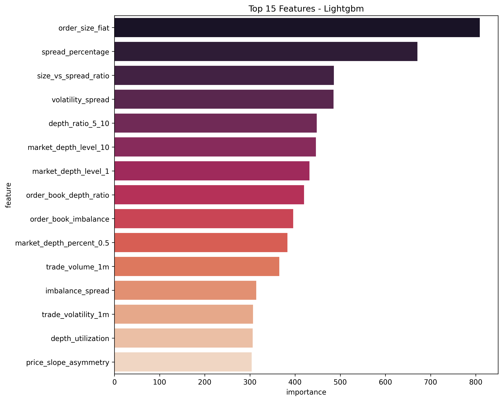
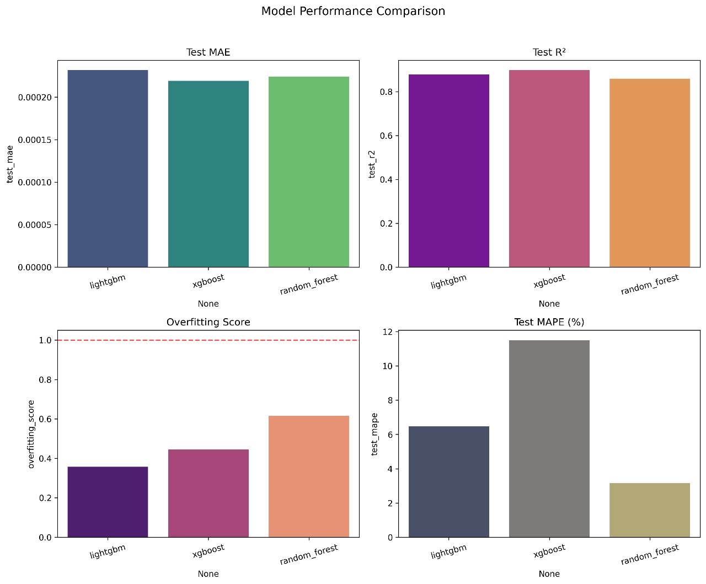
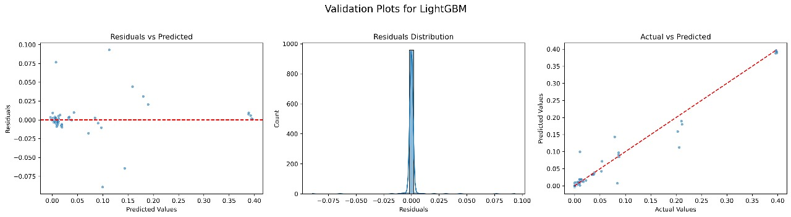
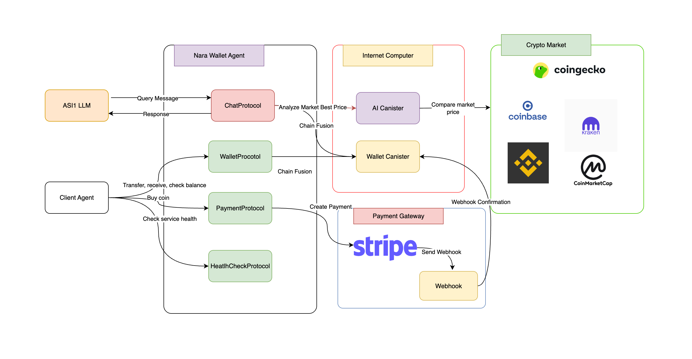

# Nara Wallet - AI First Wallet for Everyone


[](https://opensource.org/licenses/MIT)
[](https://internetcomputer.org/)
[](https://fetch.ai/)

Nara Wallet is an AI powered conversational wallet agent built to simplify crypto adoption and make digital asset management accessible to everyone. It is designed to work seamlessly across multiple blockchain networks including Bitcoin, Ethereum, Solana, Internet Computer, and others. Nara Wallet allows users to create wallets, send and receive funds, check balances, buy crypto with fiat, and compare market prices in real time, all through natural language interaction without the need to understand technical blockchain commands. The platform integrates a smart assistant interface where users can simply type everyday instructions such as "I want to buy Bitcoin" or "Show me my balance" and instantly get actionable results. Built on top of the Fetch.ai agent framework, Nara Wallet leverages autonomous AI agents to process requests intelligently and deliver secure, real time interaction

🌟 **Built for NextGen Agents Hackathon 2025** - [View on DoraHacks](https://dorahacks.io/buidl/31746/)

## 🎯 Why Nara?

Nara Wallet addresses key challenges in crypto adoption:

- Global crypto holders reached **659M** in **2024**, yet only 30–60M are active monthly users **(a16z, Crypto.com)**
- **90%** of potential users admit they do not understand how to use crypto, and **49%** do not know how it works **(NCA, 2025)**
- Studies show ease of use, trust, and accessibility are the main barriers to adoption **(PMC, RIF, Nature)**

Our solution introduces an AI-powered conversational wallet agent built on Fetch.ai and internet computer protocol, enabling users to create wallets, transfer funds, check balances, buy crypto with fiat, and compare market prices across chains through simple natural language interaction.

## 🏆 Features of Nara

- **Crypto Asset Transfer**
  Send coins such as BTC, ETH, SOL, and SOL to other wallet addresses with simple chat instructions. Includes network and address validation to minimize errors.

- **Wallet Address Creation**
  The AI Agent automatically generates new wallet addresses for multiple crypto assets, ready to be used for sending and receiving.

- **Receive Crypto Assets**
  Easily request and display your wallet address so others can send you assets. Copy and share in just one click.

- **Check Wallet Balance**
  View real time balances for each asset along with basic activity history to keep track of your funds.

- **Buy Crypto (Stripe Payment)**
  Purchase coins directly through integrated payment providers without leaving the conversation. Balance updates are handled automatically after confirmation.

- **Crypto to Fiat Conversion**
  Get instant exchange rates from crypto to fiat currencies such as USD and IDR, helping users understand the real value of their holdings.

- **Cross Market Price Comparison (AI)**
  Compare coin prices across multiple sources including CoinGecko, CoinMarketCap, and Coinbase. The system highlights the most competitive option in real time.

- **AI Based Best Price Recommendation**
  AI recommends the most favorable market for buying or selling coins based on live price comparison data.

### 🤖 How the Market Price AI Works (White-Box View):

- **Real-Time Data Ingestion**: Constantly pulls live order book data and recent trade history from major exchanges (Binance, Kraken, Coinbase, etc.).
- **Advanced Feature Engineering**: Extracts 30+ market microstructure features, including:

  - _Liquidity & Depth_: Volume available at different price levels.
  - _Market Volatility_: Recent price fluctuations and trade frequency.
  - _Order Book Imbalance_: Ratio of buy-to-sell pressure.
  - _Price Impact Slope_: Sensitivity of price to large orders.

- **Realistic Trade Simulation**: Builds a proprietary dataset by simulating thousands of trades under live market conditions, modeling slippage, partial fills, and exchange-specific factors.
- **Predictive Modeling**: Uses LightGBM to predict slippage percentages, highlighting the most influential features driving trade cost.

#### What the AI Prioritizes:

Our model has learned that the most critical predictors of final trade cost are:

- **Order Size (Fiat Value)** – Larger trades relative to market depth have the strongest impact on slippage.
- **Spread Percentage** – The gap between buy and sell prices significantly affects execution efficiency.
- **Size vs. Spread Ratio & Volatility Spread** – How order size interacts with market volatility and spread conditions.
- **Order Book Depth** – Availability of liquidity across different levels (e.g., top 1 level, top 10 levels, and 5–10 depth ratios).

Other factors such as trade volume, order book imbalance, and depth utilization still contribute, but with less influence compared to the above.

| Lightgbm Features                                       | Model Comparison                              |
| ------------------------------------------------------- | --------------------------------------------- |
|  |  |

| Validation Plot                              |
| -------------------------------------------- |
|  |

## 🚀 Build and Deployment Instructions

### Prerequisites

- [ ] Install the [IC SDK](https://internetcomputer.org/docs/current/developer-docs/setup/install/index.mdx)
- [ ] On **macOS**, an `llvm` version that supports the `wasm32-unknown-unknown` target is required.
- [ ] Install the [MOPS Package manager](https://docs.mops.one/quick-start#2-install-mops-cli)
- [ ] Install cargo

### Install Bitcoin Locally with Regtest

Nara Wallet Agent includes native Bitcoin functionality. For testing and development, you can run a local Bitcoin regtest instance. Follow this guide to set up your environment: [Install bitcoin on local machine](https://internetcomputer.org/docs/build-on-btc/btc-dev-env)

### Environment Setup

To run the demo, create a .env file (or copy from .env.example) and add the following keys:

```bash
 ASI1_API_KEY='YOUR_ASI1_API_KEY'
 STRIPE_API_KEY='YOUR_STRIPE_KEY'
 STRIPE_ENDPOINT_SECRET='YOUR_STRIPE_ENDPOINT_SECRET'
 STRIPE_WEBHOOK_URL='YOUR_STRIPE_WEBHOOK_URL'
```

### Start ICP Local Network:

- Clone repository
  ```sh
   git clone https://github.com/gaskeunbang/nara
   cd nara/
  ```
- Start local Internet Computer replica

  ```sh
   dfx start --clean --background
  ```

- Deploy deploy script using Makefile

  ```sh
   make deploy
  ```

### Start AI Agents:

- in seperate terminal, setup python venv

  ```sh
   cd fetch/
   python -m venv venv
   source venv/bin/active
  ```

- Install depedencies

  ```sh
   python -m venv venv
   source venv/bin/active
  ```

- Runing agent
  ```sh
   python agent.py
  ```
- The agent will start and display its address and inspector URL:

```
INFO: [NaraWalletAgent]: Starting agent with address: agent1qdla8t5m3wm7tnua69jjv3p4cr4ugmzmcj95jy9vrh4209scxs02qlxwt0g
INFO: [Nara Wallet Agent]: Agent inspector available at https://agentverse.ai/inspect/?uri=http%3A//127.0.0.1%3A8001&address=agent1qdla8t5m3wm7tnua69jjv3p4cr4ugmzmcj95jy9vrh4209scxs02qlxwt0g
```

- Click on the Agent Inspector link to connect the agent with Agentverse via Mailbox

### Run the stripe webhook:

- in seperate terminal
  ```sh
   cd fetch/
   source venv/bin/active
   python webhook.py
  ```
- Using Ngrok or any Tunneling Software, Create secure https endpoint and set it up as a webhook in Stripe dashboard under the webhook section.

### 🧪 Testing Your Installation

```bash
# Test AI agents health (use 0.0.0.0 for testing)
curl http://0.0.0.0:8001/health  # Agent

# Test canister
dfx canister call wallet coin_network '()'
dfx canister call ai health_check '()'
```

## 🎨 Example Query

Here are sample chat commands you can send to the Nara Wallet Agent:

| **Name**                               | **Chat Query**                                               |
| -------------------------------------- | ------------------------------------------------------------ |
| Check / Generate User Wallet Addresses | Check all my coin address                                    |
| Check balance                          | Check my current Solana balance                              |
| Transfer                               | I want to send 0.1 ICP coin to this address: issvv-4a....    |
| Buy Crypto (Stripe Payment)            | I want to buy 0.003 Bitcoin                                  |
| Check coin price on market             | How much is 1 Ethereum in USD right now?                     |
| AI Market Analyzer                     | I want to check the best market price to sell 1 BTC for USDT |

## 🏗️ Architecture



Below is the Nara Wallet sequence diagram illustrating the flow for the Buy Crypto with Fiat feature, integrated with Stripe payment and webhook.


## 📎 Demo App

| Nara Wallet Landing Page            | Agent Welcome Message               |
| ----------------------------------- | ----------------------------------- |
|  |  |

| Check Balance                       | Transfer                             |
| ----------------------------------- | ------------------------------------ |
|  |  |

| Buy Crypto                      | Check coin price                  |
| ------------------------------- | --------------------------------- |
|  |  |

| AI Analyzer for Crypto Market       |
| ----------------------------------- |
|  |

## 🔮 Future Plan: The AI Gateway to Web3

Nara Wallet’s vision goes beyond simplifying crypto transactions. Our goal is to become the AI-first entry point for mainstream Web3 adoption, enabling anyone to access, manage, and grow their digital assets with confidence. By combining conversational AI with cross-chain infrastructure, Nara Wallet will expand from basic wallet functions into a comprehensive ecosystem of payments, trading, and intelligent financial guidance.

Just as we simplify wallet creation and transactions today, in the future Nara will bring the same AI-powered simplicity to DeFi, NFTs, and cross-chain services—bridging the gap between complex blockchain systems and everyday users.

### 📅 Phase 1 (Q4 2025) – Production Launch

- **🌍 ICP Mainnet Deployment:** Core wallet features live (create, transfer, receive, balances)

- **🤖 Fetch.ai Agent Integration:** Conversational agent for natural language commands

- **💳 Fiat On-Ramp:** Stripe webhook integration for crypto purchases

- **📊 Basic Price Comparison:** Multi-market feed (CoinGecko, CoinMarketCap, Coinbase)

### 📅 Phase 2 (2026) – Enhanced Intelligence

- **⚡ Agent-to-Agent Collaboration:** Market insights via Fetch.ai agent network

- **📈 Portfolio Tracking:** AI-generated balance summaries and transaction insights

- **🔐 Security Features:** Risk alerts for suspicious addresses and transaction checks

- **🌏 Multi-language Support:** English and Indonesian adoption

### 📅 Phase 3 (2027) – Ecosystem Growth

- **⛓️ Cross-Canister Interoperability:** Support for ICP DeFi canisters and ICRC-1/ICRC-2 tokens

- **🛒 AI Agent Marketplace:** Interact with other agents (conversion, analytics, payments)

- **🏛️ Community Feedback Loop:** Continuous improvement with user training data

- **🔬 Open Contribution:** Open-sourced modules for ICP + Fetch.ai integration

## 📃 License

Distributed under the MIT License. See `LICENSE.txt` for more information.

## 🍀 Our Teams

- Aaron Joseph Karel Daimbani (Blockchain Developer)
- Arvin Taoran Anthaq (AI Agent Developer)
- Tiyas Insania Dhikananda (UI/UX Designer)
- Muhammad Fajar Mufid (Digital Business)
- Farrel Haykal Al Giffari (Frontend Developer)
